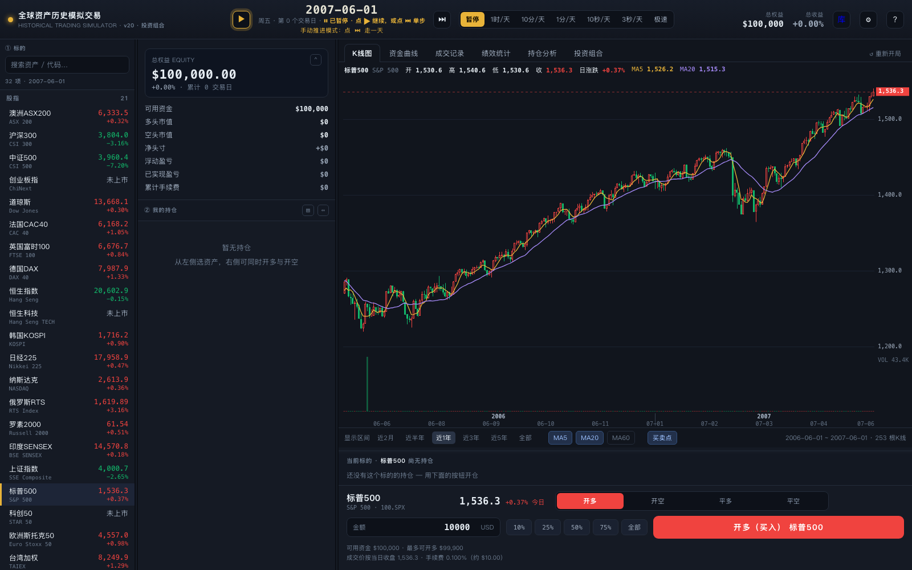
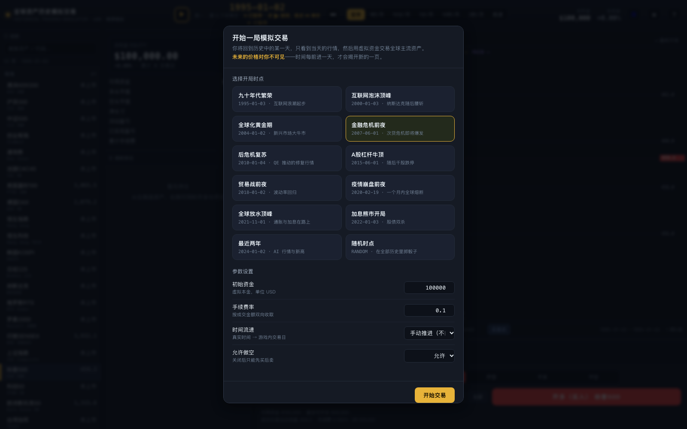
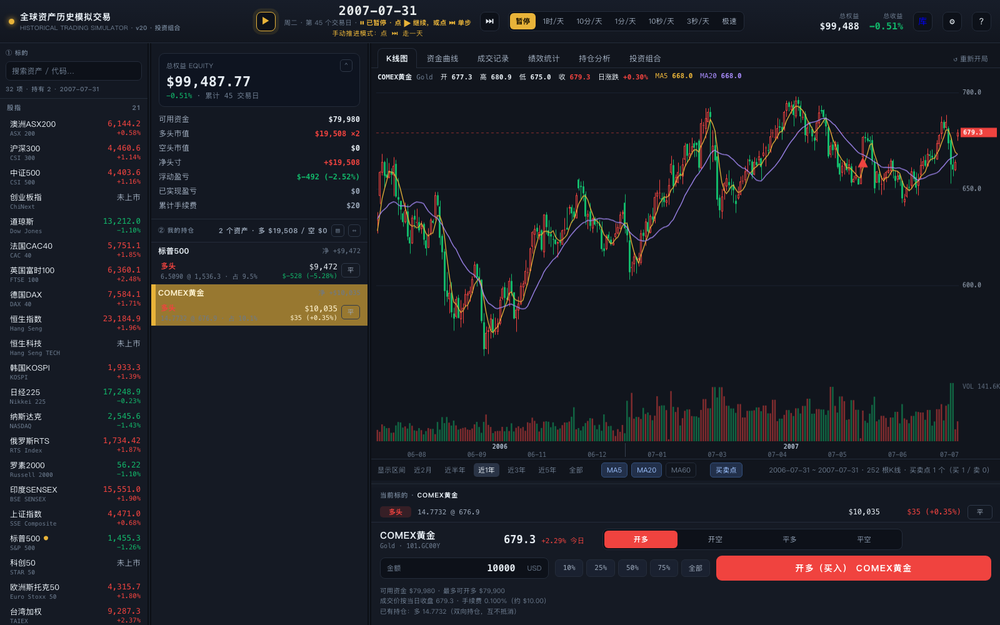
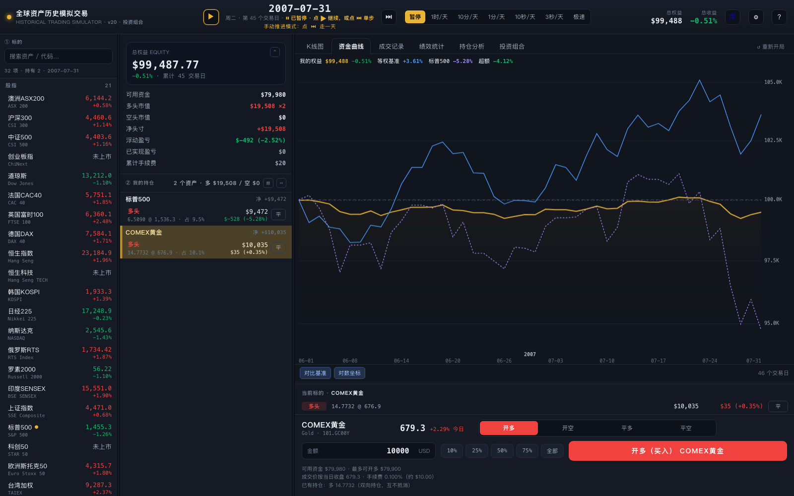
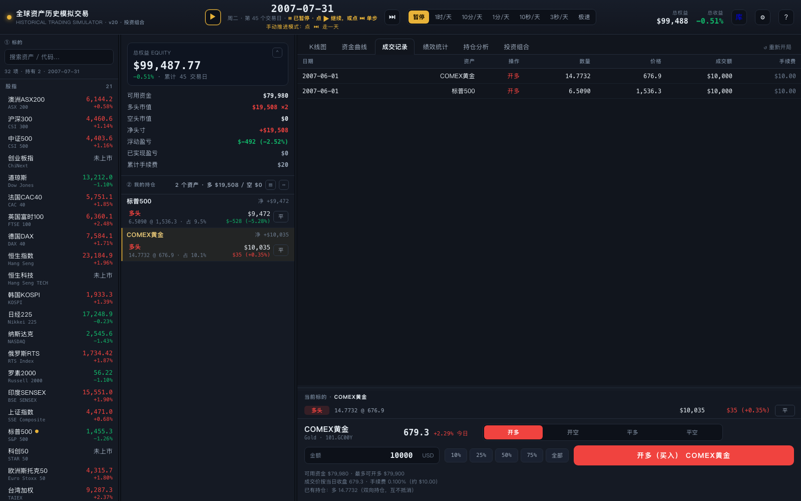
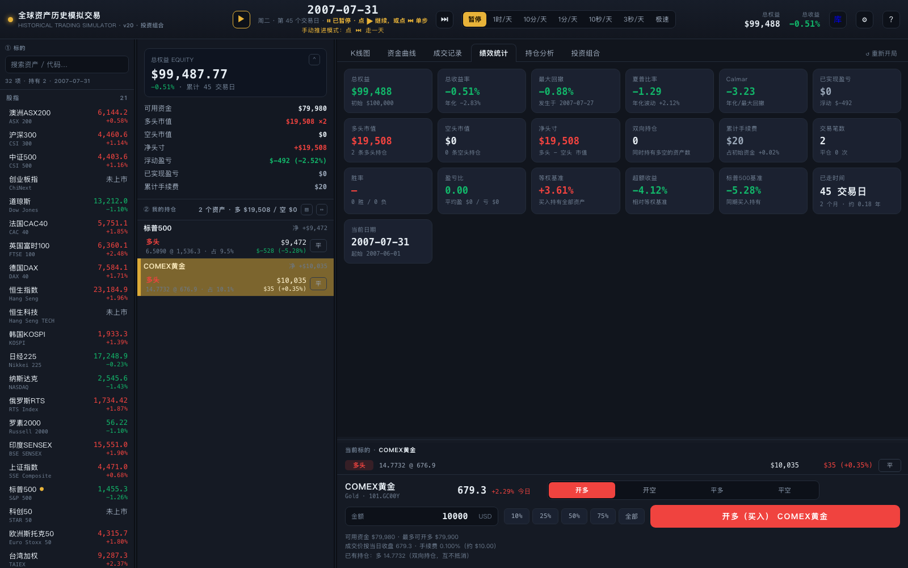

# 全球资产历史模拟交易

在线页面：<https://yidaibit.github.io/historical-trading-simulator/>

这是一个用历史日线做的模拟交易练习场。打开后选定某一天，图表只画到当天，你用虚拟资金买卖；时间每前进一天，才看得到新的一根 K 线。

在线页面和这个仓库都不包含行情文件。打开在线页面会停在「请放入 data/payload.js」。要在自己电脑上玩，需要自备这份行情载荷。

## 适合谁用

- 想在看不到后市的情况下练习下单的人
- 想把自己的成绩和「买入持有」放在一起看的人
- 不想注册账号，进度只留在自己浏览器里的人

## 总览

开局之后画面分成三栏。左边是资产列表，中间是账户和持仓，右边是 K 线和买卖。上图停在 2007-06-01「金融危机前夜」，选中的是标普500，收盘 1,536.3，总权益还是初始的 10 万美元。图的右缘就是「今天」，后面的价格没有画出来。

## 怎么打开

你自己的目录里如果已经有 `data/payload.js`，用浏览器打开 `index.html` 即可。克隆下来的仓库没有这份文件，按下面三步准备：

1. 克隆本仓库。
2. 把行情载荷放到 `data/payload.js`。文件需要提供全局变量 `PAYLOAD`，页面启动时由 `js/01_codec.js` 解码。
3. 在项目目录执行 `python3 -m http.server 8765`，打开 <http://127.0.0.1:8765/>。

进度写在浏览器的 `localStorage` 里，关掉再打开可以续上一局。

## 能做什么

### 选一个历史时点开局

开始前先选时点。上图选的是「金融危机前夜」，日期是 2007-06-01。初始资金 10 万美元，手续费按成交金额收 0.1%，允许做空。时间流速选了「手动推进」，这样日期不会自己往前走，要点顶栏的单步才进入下一个交易日。

可选时点还有互联网泡沫、A 股杠杆牛顶、疫情前、随机时点等。随机时点会在整段历史里抽一天。

### 看当天的 K 线并下单

左边点一个资产，右边按金额开多或开空。成交价是当天收盘价，再按费率扣手续费。同一资产可以同时持有多头和空头。

上图的操作是：在 2007-06-01 分别用 1 万美元开多标普500 和 COMEX黄金，然后单步走到 2007-07-31，共 45 个交易日。K 线上的红色三角是这两笔开多。中间持仓栏能看到数量、均价和浮动盈亏。这一天总权益是 99,487.77 美元，收益 -0.51%。

持仓行上的「平」可以只减一部分，比例有 10%、25%、50%、75% 和全部。

### 对照资金曲线

切到「资金曲线」。黄线是自己的权益，另外两条是等权买入持有和标普500。上图这一局走到 2007-07-31：自己 -0.51%，等权基准 +3.61%，标普500 -5.28%，相对等权基准的超额是 -4.12%。

### 看成交记录

「成交记录」按时间列出每一笔。上图两笔都发生在 2007-06-01：COMEX黄金开多 14.7732 份，价格 676.9，金额 10,000 美元，手续费 10 美元；标普500 开多 6.5090 份，价格 1,536.3，同样是 10,000 美元，手续费 10 美元。

### 看绩效统计

「绩效统计」把权益、收益率、最大回撤、夏普、手续费和交易笔数放在一屏。上图对应同一局：总权益 99,488 美元，收益 -0.51%，最大回撤 -0.88%，两笔交易都还没平，已实现盈亏是 0，已走 45 个交易日。

另外还有「持仓分析」和「投资组合」。持仓分析看各类资产占比和盈亏贡献。投资组合可以把几只资产配上权重，再按权重点一次加仓或减仓。组合保存在浏览器本地，换一局还在。

## 数据存在哪里，什么不会上传

- `data/payload.js` 是压缩后的日线开高低收，`dataset.html` 是覆盖范围和价格摘要。这两份都留在本机，没有放进仓库，在线页面里也没有。
- 交易进度、界面栏宽和投资组合写在浏览器 `localStorage`，不会发到服务器。
- 本机项目入口页带有本机路径，没有上传。

没有行情文件时，页面会停在提示，不会只剩一屏脚本错误。股指、商品、汇率、加密货币的日线需要你自己准备。商品若使用没有展期复权的连续合约，长周期涨跌只适合看形态和波动。

这是模拟练习，不构成投资建议。

## 目录

| 路径 | 内容 |
| --- | --- |
| `index.html` | 模拟交易页面 |
| `css/simulator.css` | 交易台样式 |
| `js/01_codec.js` | 行情载荷解码 |
| `js/02_chart.js` | K 线与资金曲线 |
| `js/03_game.js` | 交易、持仓、绩效、投资组合 |
| `docs/` | 上面这些界面截图 |
